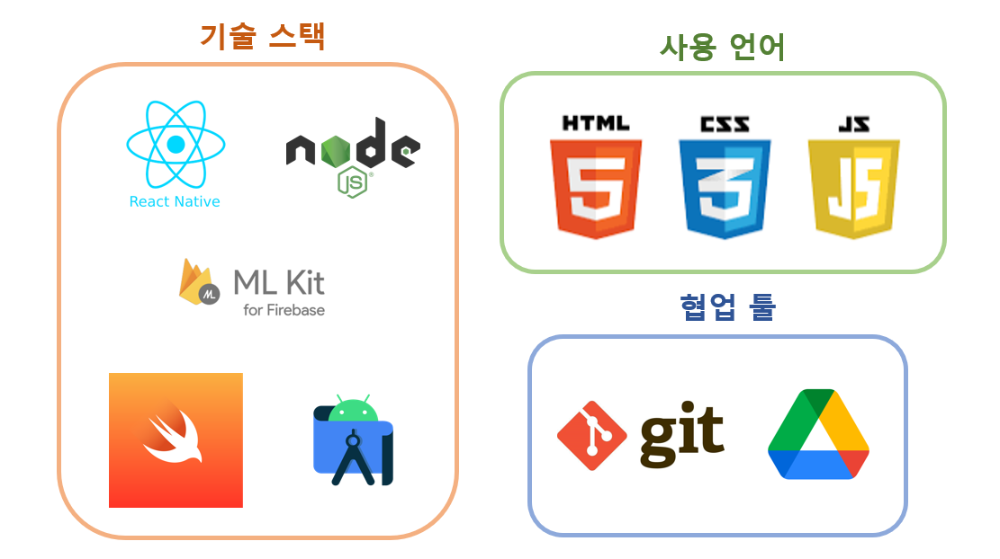

# UHear

## **UHear**은 시각장애인 소비자를 위한 유통기한 및 제품명 음성안내 앱입니다.

[iOS]

[Android]

[시연영상]

<a href="https://www.youtube.com/watch?v=71LNVvs28Tk">youtube</a>

## 앱 설치

---

### 📌 iOS

..

### 📌 Android

1. Xcode  
   ...
2. TestFlight  
   ...

## 개발 환경

---

IDE : Visual Studio Code / Android Studio / Swift  
라이브러리 : React-native  
사용 언어 : HTML / CSS / JavaScript  
SDK : firebase MLKit / Google Cloud Vision  
개발 서버와 연결 : Node.js  
협업 툴 : git / Google Drive  

## 라이브러리

---

<a href="https://github.com/react-native-camera/react-native-camera">React Native Camera</a>  
<a href="https://github.com/ak1394/react-native-tts">React Native TTS</a>  

## Contributors

---

<a href="https://github.com/oiatmil"> Lee Sumin</img></a>  
<a href="https://github.com/dimplehh"> Lee Hyunhee</img></a>
